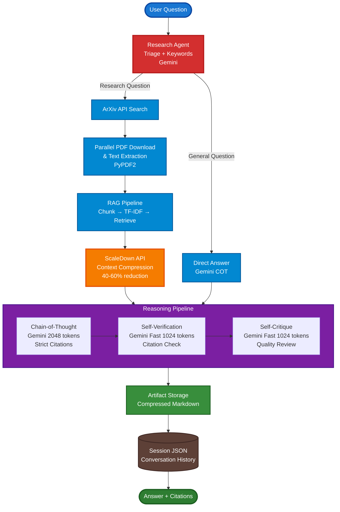
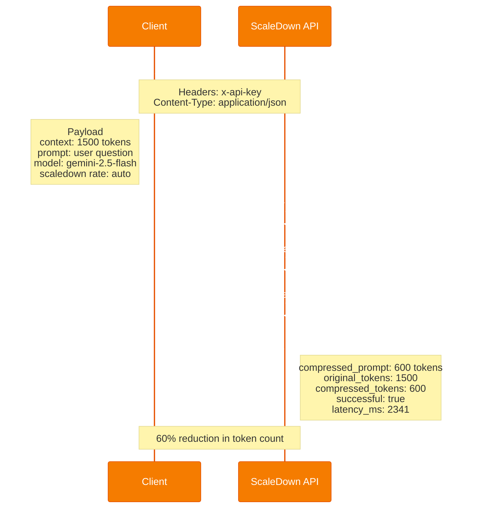
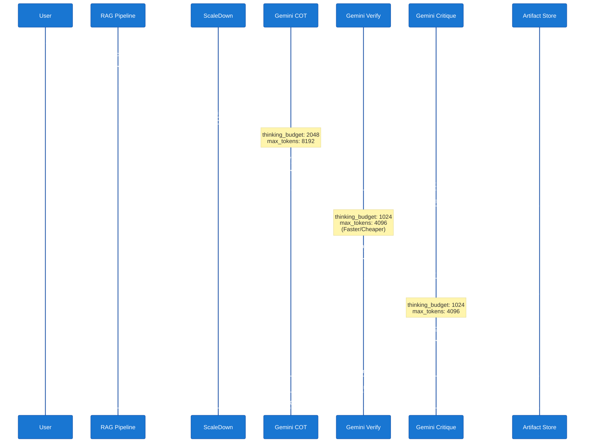
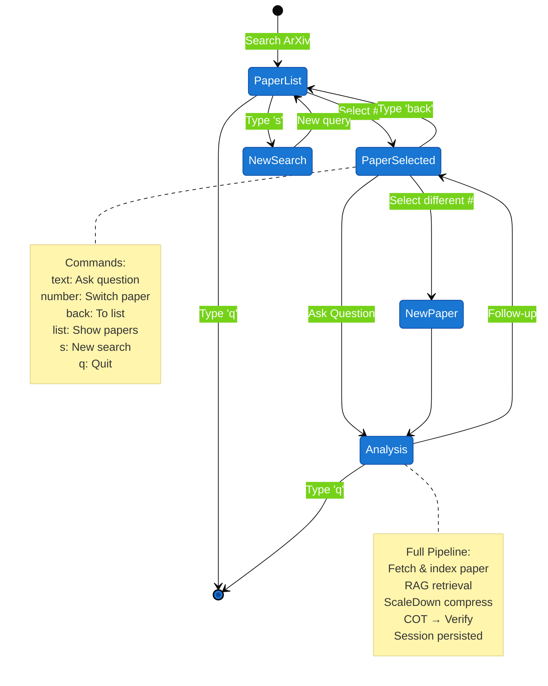
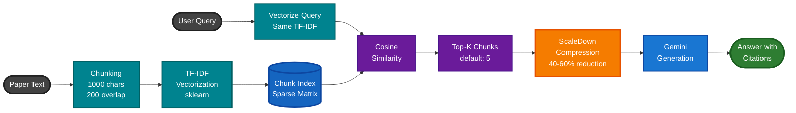
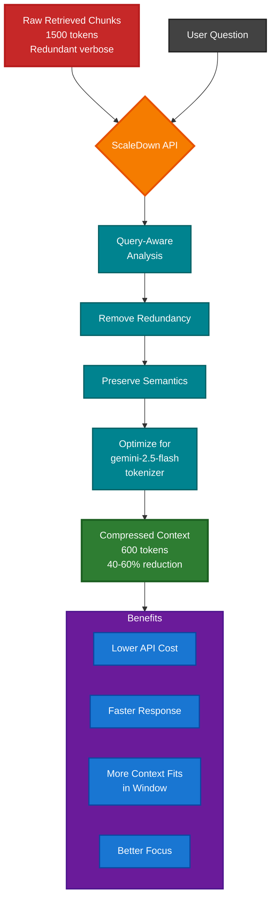
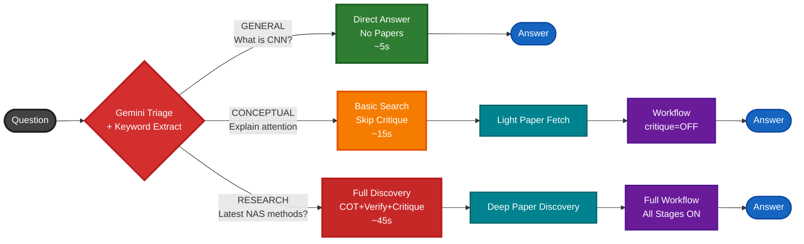
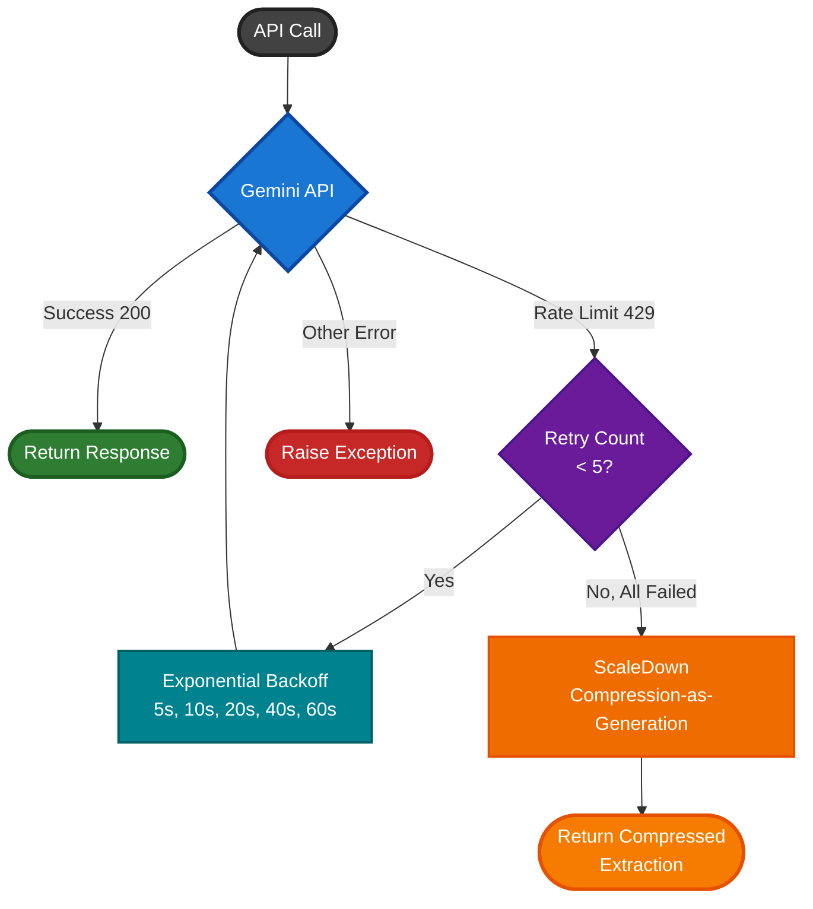

# Scientific Literature Explorer

A **Retrieval-Augmented Generation (RAG)** system for exploring scientific papers from ArXiv, powered by **ScaleDown API** for context compression and **Google Gemini** for intelligent answer generation. Features a multi-stage anti-hallucination workflow with chain-of-thought reasoning, self-verification, and self-critique.

---

## Table of Contents

- [Architecture Overview](#architecture-overview)
- [How It Works](#how-it-works)
- [Role of ScaleDown API](#role-of-scaledown-api)
- [Role of Google Gemini](#role-of-google-gemini)
- [Anti-Hallucination Pipeline](#anti-hallucination-pipeline)
- [Setup & Installation](#setup--installation)
- [Usage](#usage)
- [Project Structure](#project-structure)
- [Methodology](#methodology)
- [Limitations](#limitations)
- [Possible Improvements](#possible-improvements)
- [API Reference](#api-reference)

---

## Architecture Overview



---

## How It Works

### End-to-End Flow

1. **Question Triage** — The Research Agent classifies the question as `general`, `conceptual`, or `research` using Gemini. General questions (e.g., "What is CNN?") are answered directly without paper retrieval, saving significant latency.

2. **Keyword Extraction** — In the same Gemini call as triage, search keywords and an ArXiv query are extracted. This merged call halves the initial latency.

3. **Paper Discovery** — The system searches ArXiv's Atom API for relevant papers. PDFs are downloaded in parallel using `ThreadPoolExecutor` and text is extracted via PyPDF2.

4. **Chunking & Indexing** — Paper text is split into overlapping chunks (default: 1000 chars, 200 overlap) and indexed using TF-IDF vectorization (scikit-learn).

5. **Retrieval** — The top-k most relevant chunks are retrieved using cosine similarity against the TF-IDF matrix.

6. **Context Compression** — Retrieved chunks are compressed through the ScaleDown API, reducing token count while preserving semantic meaning. This is critical for fitting more information into the LLM's context window at lower cost.

7. **Reasoning Workflow** — The compressed context passes through a configurable multi-stage pipeline:
   - **Chain-of-Thought (COT)**: Gemini generates a detailed, step-by-step analysis with mandatory inline citations
   - **Self-Verification**: A faster Gemini call checks every citation against the source documents
   - **Self-Critique** (optional): Evaluates completeness, accuracy, and clarity

8. **Artifact Storage** — Each stage's output is saved as compressed markdown with metadata (timestamps, token counts, compression stats).

9. **Session Persistence** — Conversations are saved as JSON, enabling multi-turn interactions with history context.

---

## Role of ScaleDown API

**ScaleDown** is the context compression backbone of this system. It is NOT an LLM — it's a specialized service that intelligently compresses text while preserving semantic meaning.

### What ScaleDown Does

| Function | How It's Used |
|----------|---------------|
| **Context Compression** | Retrieved RAG chunks are compressed before being sent to Gemini, reducing token usage by 40-60% |
| **Query-Aware Compression** | The user's question is passed as the `prompt` parameter, so ScaleDown preserves information most relevant to the query |
| **Artifact Compression** | COT traces, verification tables, and critique outputs are compressed before storage |
| **Fallback Generation** | When Gemini is rate-limited (429), ScaleDown's compression endpoint (which internally uses GPT-4o) is used as a pseudo-generation fallback |

### ScaleDown API Endpoint



**Raw API Example:**

```bash
curl -X POST https://api.scaledown.xyz/compress/raw/ \\
  -H "x-api-key: YOUR_KEY" \\
  -H "Content-Type: application/json" \\
  -d '{
    "context": "The text to compress...",
    "prompt": "The user question (guides compression)",
    "model": "gemini-2.5-flash",
    "scaledown": { "rate": "auto" }
  }'
```

### ScaleDown as Fallback

When Gemini hits its rate limit (429 errors), the system automatically falls back to ScaleDown:

```
Gemini (primary) → rate limited → ScaleDown compression-as-generation (fallback)
```

ScaleDown's internal model processes the system prompt + user question as "context" and produces a compressed, relevant extraction. While not a full generative response, it captures the key facts from the provided context.

---

## Role of Google Gemini

**Gemini 2.5 Flash** is the intelligence layer — it generates answers, classifies questions, extracts keywords, and powers the anti-hallucination pipeline.

### Gemini Usage in the System

| Component | Model Config | Purpose |
|-----------|-------------|---------|
| **Question Triage + Keywords** | `temperature=0.0` | Classifies question complexity and extracts search keywords in one call |
| **COT Reasoning** | `max_tokens=8192`, `thinking_budget=2048` | Full chain-of-thought analysis with citations |
| **Self-Verification** | `max_tokens=4096`, `thinking_budget=1024` | Faster/cheaper — checks citations against source text |
| **Self-Critique** | `max_tokens=4096`, `thinking_budget=1024` | Faster/cheaper — evaluates answer quality |
| **Direct Answers** | `max_tokens=8192`, `thinking_budget=2048` | For general questions that don't need papers |

### Thinking Budget

Gemini 2.5 Flash supports a `thinkingConfig` parameter that caps internal reasoning tokens. We use:
- **2048 tokens** for primary reasoning (COT, direct answers)
- **1024 tokens** for lighter tasks (verify, critique)

This prevents the model from spending excessive time on internal reasoning, reducing latency by ~40%.

### Rate Limit Handling

```python
# Exponential backoff: 5s, 10s, 20s, 40s, 60s
# After 5 retries → raises GeminiRateLimitError
# Caller catches it → falls back to ScaleDown
```

---

## Anti-Hallucination Pipeline

The system uses a multi-stage approach to minimize hallucination:



### Stage 1: Strict Citation Rules (COT)

The COT handler enforces mandatory citation rules in its system prompt:

```
CITATION RULES (mandatory):
- Every factual claim MUST have an inline citation like [arxiv:XXXX.XXXXX]
- Quote or closely paraphrase the source text
- If a claim has no supporting source, mark it as [unsupported — general knowledge]
- End with a ## References section listing all cited sources
```

### Stage 2: Self-Verification

The verify handler checks every citation:

```
For EACH citation:
1. Find the exact passage in Source Context that supports it
2. Quote that passage verbatim
3. Rate: SUPPORTED / PARTIALLY SUPPORTED / NOT FOUND IN SOURCES
4. Flag any claims that SHOULD have a citation but don't

Output: Markdown table → Claim | Citation | Source Quote | Verdict
```

### Stage 3: Self-Critique (Optional)

A senior reviewer evaluates completeness, accuracy, and clarity with improvement suggestions.

### Paper Deep-Dive Mode

When analyzing a specific paper (`paper` or `papers` command), the system adds extra grounding:

```
IMPORTANT: You are analysing a SPECIFIC research paper.
ONLY use information from the paper excerpts below.
Do NOT add information from your training data.
If the paper does not mention something, say so.
Cite specific sections, equations, figures, or tables.
```

---

## Setup & Installation

### Prerequisites

- Python ≥ 3.10
- A [ScaleDown API key](https://blog.scaledown.ai/blog/getting-started)
- A [Google Gemini API key](https://aistudio.google.com/apikey) (free tier available)

### Install

```bash
git clone <repo-url>
cd RAG

python -m venv venv
source venv/bin/activate

pip install -r requirements.txt
```

### Configure

Copy `.env.example` to `.env` and fill in your keys:

```bash
cp .env.example .env
```

```env
SCALEDOWN_API_KEY=your_scaledown_api_key_here
GEMINI_API_KEY=your_gemini_api_key_here

# Optional overrides
SCALEDOWN_MODEL=gemini-2.5-flash    # target model for compression optimization
GEMINI_MODEL=gemini-2.5-flash       # Gemini model to use
CHUNK_SIZE=1000                      # characters per chunk
CHUNK_OVERLAP=200                    # overlap between chunks
TOP_K=5                              # chunks to retrieve
```

---

## Usage

### Ask a Research Question

```bash
# Auto-discovers papers, compresses context, runs anti-hallucination pipeline
python -m src.main ask "What are the latest advances in neural architecture search?"

# Continue an existing session
python -m src.main ask "How does this compare to random search?" --session abc123
```

### Interactive Paper Explorer

```bash
# Search, browse, select, and ask questions about specific papers
python -m src.main papers "attention mechanism transformers"
```



This interactive mode:
- Maintains a **persistent session** across all interactions
- **Reuses downloaded papers** — no refetching on follow-ups
- **Preserves conversation history** — LLM sees previous Q&A
- Runs the **full anti-hallucination pipeline** for every answer

### Deep-Dive into a Specific Paper

```bash
# Ask a question about a known paper (uses full COT → verify pipeline)
python -m src.main paper 1706.03762 "What is the multi-head attention mechanism?"
```

### Search ArXiv

```bash
# Quick search without analysis
python -m src.main search "graph neural networks"
```

### Manage Sessions

```bash
# List all conversation sessions
python -m src.main sessions
```

### Configure Workflow

```bash
# Show current pipeline stages
python -m src.main workflow show

# Enable/disable stages
python -m src.main workflow toggle self_critique on
python -m src.main workflow toggle self_verify off

# Reorder stages
python -m src.main workflow reorder cot,self_verify,self_critique
```

### View Artifacts

```bash
# List all stored reasoning artifacts
python -m src.main artifacts list
```

---

## Project Structure

```
RAG/
├── .env                          # API keys (not in git)
├── .env.example                  # Template for API keys
├── .gitignore
├── Project.md                    # Original project specification
├── README.md                     # This file
├── requirements.txt              # Python dependencies
│
├── src/
│   ├── __init__.py
│   ├── main.py                   # CLI entry point — all commands
│   │
│   ├── core/
│   │   ├── config.py             # Central configuration (env vars, paths)
│   │   ├── gemini.py             # Gemini API client + rate-limit retry + fallback
│   │   ├── llm.py                # LLM-agnostic handler factories (COT, verify, critique)
│   │   ├── research_agent.py     # Smart discovery — triage, keywords, ArXiv, web fallback
│   │   ├── scaledown.py          # ScaleDown compression client + generation fallback
│   │   └── session.py            # Session persistence (JSON-based conversation history)
│   │
│   ├── papers/
│   │   └── fetcher.py            # ArXiv Atom API search + PDF download/extraction
│   │
│   ├── rag/
│   │   └── pipeline.py           # TF-IDF chunking, retrieval, and ScaleDown compression
│   │
│   ├── storage/
│   │   └── artifact_store.py     # Markdown artifact storage with compression
│   │
│   └── workflow/
│       └── engine.py             # Configurable reasoning pipeline (stages, toggle, reorder)
│
├── artifacts/                    # Stored COT/verify/critique markdown files
│   ├── cot/
│   ├── self_verify/
│   └── self_critique/
│
├── papers/                       # Cached PDFs and extracted text
│   ├── *.pdf
│   └── *.txt
│
└── sessions/                     # Conversation history (JSON per session)
    └── *.json
```

---

## Methodology

### 1. Retrieval-Augmented Generation (RAG)



The RAG pattern ensures answers are grounded in actual paper content rather than relying solely on the LLM's training data:

- **Chunking**: Papers are split into overlapping segments (1000 chars, 200 overlap) to ensure no information is lost at boundaries
- **TF-IDF Vectorization**: scikit-learn's `TfidfVectorizer` creates sparse vector representations with English stop-word removal
- **Cosine Similarity**: Queries are matched against the chunk index; top-k (default 5) most similar chunks are retrieved
- **Source Tracking**: Every chunk retains its source label (e.g., `arxiv:2511.14362`) for citation tracing

### 2. Context Compression (ScaleDown)



Raw retrieved chunks are often redundant. ScaleDown's compression:
- Reduces token count by 40-60% while preserving semantics
- Uses the user's question as a guide (`prompt` parameter) to prioritize relevant information
- Optimizes for the target model's tokenizer (`gemini-2.5-flash`)
- The `"rate": "auto"` setting lets ScaleDown determine optimal compression

### 3. Multi-Stage Reasoning Workflow

Inspired by research on self-verification and chain-of-verification (CoVe):

- **Chain-of-Thought**: Forces step-by-step reasoning, reducing reasoning errors
- **Self-Verification**: A separate LLM call cross-references every claim against source documents
- **Self-Critique**: An independent evaluator checks for completeness and accuracy
- Stages are **configurable** — enable, disable, or reorder via CLI

### 4. Question Triage



A single Gemini call classifies questions into three tiers:
- **General**: Simple factual questions → answered directly (no paper fetch, ~5s)
- **Conceptual**: Needs depth but not specific papers → uses workflow but may skip critique
- **Research**: Needs actual papers → full discovery + workflow pipeline

This saves 60-90 seconds for simple questions by skipping paper discovery entirely.

### 5. Resilient LLM Strategy



**Implementation:**
```python
Primary: Gemini 2.5 Flash (full generation)
    │
    ├── Rate limited (429)?
    │   └── Retry with exponential backoff (5× up to 60s)
    │       └── Still limited?
    │           └── Fallback: ScaleDown compression-as-generation
    │
    └── Research Agent rate-limited?
        └── Heuristic keyword extraction (regex-based, no API call)
```

---

## Limitations

### ArXiv-Only Source

- **Only ArXiv papers are supported** as primary sources. The system cannot fetch papers from IEEE, ACM, Springer, PubMed, or other academic databases.
- ArXiv's public API has **rate limits** (no auth) and returns results sorted by relevance using basic keyword matching — not semantic search.
- **PDF extraction quality varies** — heavily formatted papers, tables, equations, and figures are often poorly extracted by PyPDF2. Mathematical notation is frequently garbled.

### ScaleDown API Constraints

- ScaleDown is a **compression-only service** — it cannot generate free-form answers. The "fallback generation" is really compressed extraction, not true generation.
- Compression quality depends on context length; very short texts (< 200 chars) are skipped.
- Each API call adds 1-3 seconds of latency.
- Requires a valid API key — no free tier.

### Gemini Free Tier Limitations

- The free Gemini API has strict **rate limits** (requests per minute / tokens per day). Heavy usage will trigger 429 errors.
- **Gemini 2.5 Flash** is fast but not as capable as Pro models for complex multi-hop reasoning.
- The `thinkingConfig` parameter caps internal reasoning, which can reduce quality on highly complex questions.

### RAG Limitations

- **TF-IDF retrieval** is keyword-based, not semantic. It may miss relevant chunks that use different terminology (synonym problem).
- **Fixed chunk sizes** don't respect document structure — a chunk may cut through a sentence, table, or equation.
- **No re-ranking** — retrieved chunks are scored solely by TF-IDF cosine similarity. No cross-encoder or LLM-based re-ranking is applied.

### General

- **No real-time data** — only papers already on ArXiv. No preprint servers, blogs, or live research.
- **Single-language only** — English papers only.
- **No figure/image analysis** — extracted text doesn't include figures or diagrams.
- **Session state is local** — sessions are stored as JSON files on disk, not in a database.

---

## Possible Improvements

### Short-Term (Easy Wins)

| Improvement | Impact | Effort |
|---|---|---|
| **Semantic embeddings** (Sentence Transformers / Qwen3-Embedding) instead of TF-IDF | Much better retrieval quality | Medium |
| **Cross-encoder re-ranking** after initial TF-IDF retrieval | Higher precision top-k | Low |
| **Async HTTP calls** (aiohttp) for parallel Gemini + ScaleDown | Lower latency | Medium |
| **ScaleDown Python SDK** (`pip install scaledown`) instead of raw HTTP | Cleaner code, batch support, built-in retry | Low |
| **Response caching** — cache Gemini responses by (question, context_hash) | Eliminates repeat latency | Low |
| **Better PDF extraction** — use `pymupdf` or `pdfplumber` instead of PyPDF2 | Better text quality, especially tables | Low |

### Medium-Term

| Improvement | Impact | Effort |
|---|---|---|
| **ScaleDown SemanticOptimizer** — use their FAISS-based semantic search | Replace TF-IDF entirely | Medium |
| **ScaleDown Pipeline** — chain HasteOptimizer → Compressor via their `Pipeline` class | Structured compression pipeline | Medium |
| **Multi-source support** — add Semantic Scholar API, PubMed, IEEE Xplore | Much wider paper coverage | High |
| **Streaming responses** — stream Gemini output token-by-token | Better UX for long answers | Medium |
| **Web UI** (Streamlit/Gradio) instead of CLI | Broader accessibility | Medium |
| **Configurable thinking budget** per question complexity | Better quality/speed trade-off | Low |

### Long-Term

| Improvement | Impact | Effort |
|---|---|---|
| **ScaleDown Pareto Merging** — dynamic model merging for cost-optimized reasoning | Potentially 30% cost reduction | High |
| **Knowledge graph** — build a citation graph across papers for multi-hop reasoning | Deep cross-paper analysis | High |
| **Fine-tuned embeddings** on academic text | Domain-specific retrieval | High |
| **Evaluation framework** — automated hallucination detection using ScaleDown's evaluation pipeline | Quantified quality metrics | Medium |
| **Multi-agent architecture** — separate agents for search, analysis, verification | Better specialization | High |

---

## API Reference

### Environment Variables

| Variable | Default | Description |
|----------|---------|-------------|
| `SCALEDOWN_API_KEY` | *(required)* | Your ScaleDown API key |
| `GEMINI_API_KEY` | *(required)* | Your Google Gemini API key |
| `SCALEDOWN_MODEL` | `gemini-2.5-flash` | Target model for ScaleDown compression optimization |
| `GEMINI_MODEL` | `gemini-2.5-flash` | Gemini model to use for generation |
| `SCALEDOWN_TIMEOUT` | `15` | Timeout (seconds) for ScaleDown API calls |
| `CHUNK_SIZE` | `1000` | Characters per text chunk |
| `CHUNK_OVERLAP` | `200` | Overlap between adjacent chunks |
| `TOP_K` | `5` | Number of chunks to retrieve per query |

### CLI Commands

| Command | Description |
|---------|-------------|
| `ask "question"` | Research question → auto-discover papers → full pipeline |
| `ask "question" --session ID` | Continue an existing session |
| `papers "query"` | Interactive paper explorer — search, select, ask |
| `paper <arxiv_id> "question"` | Deep-dive into a specific paper |
| `search "query"` | Search ArXiv (listing only, no analysis) |
| `ingest` | Download and index reference papers |
| `sessions` | List all conversation sessions |
| `workflow show` | Display current pipeline configuration |
| `workflow toggle <stage> <on\|off>` | Enable/disable a workflow stage |
| `workflow reorder <s1,s2,...>` | Reorder workflow stages |
| `artifacts list` | List stored reasoning artifacts |

---

## Dependencies

| Package | Purpose |
|---------|---------|
| `requests` | HTTP client for ScaleDown, Gemini, ArXiv, GitHub APIs |
| `python-dotenv` | Load `.env` configuration |
| `numpy` | Array operations for TF-IDF |
| `scikit-learn` | TF-IDF vectorizer and cosine similarity |
| `PyPDF2` | PDF text extraction from ArXiv papers |
| `rich` | Terminal UI — tables, panels, markdown, progress spinners |

---

## License

See [Project.md](Project.md) for the original project specification.
