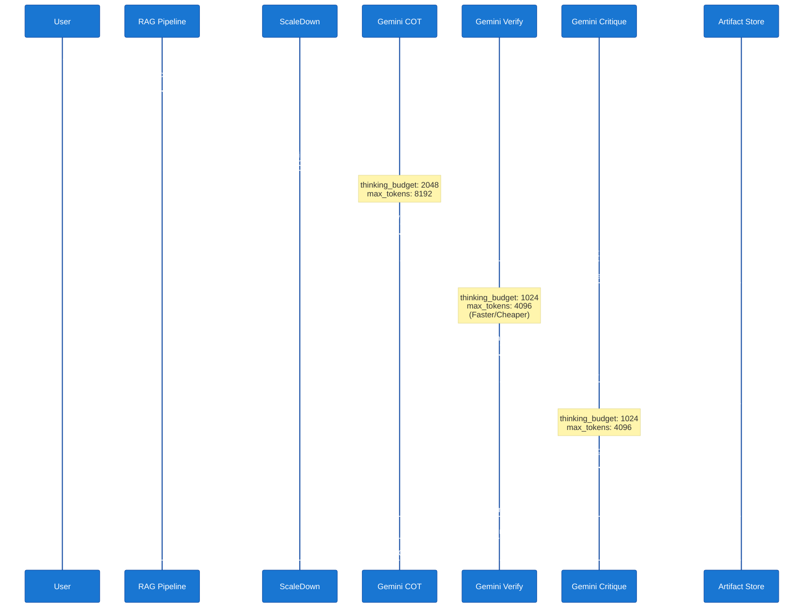

# Anti-Hallucination Pipeline

The system uses a multi-stage approach to minimize hallucination and ensure factual accuracy.

---

## Pipeline Overview



---

## Stage 1: Strict Citation Rules (COT)

The COT handler enforces mandatory citation rules in its system prompt:

```
CITATION RULES (mandatory):
- Every factual claim MUST have an inline citation like [arxiv:XXXX.XXXXX]
- Quote or closely paraphrase the source text
- If a claim has no supporting source, mark it as [unsupported — general knowledge]
- End with a ## References section listing all cited sources
```

### Goal

Force the LLM to:
- Ground every claim in source documents
- Make citation tracking explicit
- Distinguish between paper facts and general knowledge

### Output Format

The COT stage produces:
- Step-by-step reasoning
- Inline citations for every claim
- A final `## References` section with all sources

**Example:**

```
## Chain-of-Thought Analysis

Transformers use self-attention mechanisms to process input sequences
[arxiv:1706.03762]. Unlike RNNs, they allow parallel processing of all
tokens simultaneously [arxiv:1706.03762].

The multi-head attention mechanism splits the input into multiple
representation subspaces, allowing the model to attend to information
from different positions [arxiv:1706.03762].

## References

- [arxiv:1706.03762] Vaswani et al., "Attention Is All You Need"
```

---

## Stage 2: Self-Verification

The verify handler checks every citation:

```
For EACH citation:
1. Find the exact passage in Source Context that supports it
2. Quote that passage verbatim
3. Rate: SUPPORTED / PARTIALLY SUPPORTED / NOT FOUND IN SOURCES
4. Flag any claims that SHOULD have a citation but don't

Output: Markdown table → Claim | Citation | Source Quote | Verdict
```

### Goal

Cross-check every claim against source documents:
- Catch hallucinations (claims with no source)
- Validate citation accuracy (correct paper cited)
- Identify missing citations (claims that need sources)

### Output Format

The verify stage produces a markdown table:

| Claim | Citation | Source Quote | Verdict |
|-------|----------|--------------|---------|
| Transformers use self-attention | [arxiv:1706.03762] | "The Transformer... relies entirely on self-attention" | ✅ SUPPORTED |
| Allow parallel processing | [arxiv:1706.03762] | "...allows for significantly more parallelization" | ✅ SUPPORTED |
| Multi-head attention splits input | [arxiv:1706.03762] | "Multi-head attention allows the model to jointly attend to information from different representation subspaces" | ✅ SUPPORTED |

**Verification Summary:**
- 3 claims checked
- 3 supported, 0 not found
- All citations valid

---

## Stage 3: Self-Critique (Optional)

A senior reviewer evaluates completeness, accuracy, and clarity with improvement suggestions.

### Goal

High-level quality assessment:
- Is the answer complete?
- Are all aspects of the question addressed?
- Is the explanation clear?
- What could be improved?

### Output Format

The critique stage produces:

```
## Critique Report

**Completeness:** ⭐⭐⭐⭐ (4/5)
The answer covers the core concepts well but could mention the positional
encoding mechanism.

**Accuracy:** ⭐⭐⭐⭐⭐ (5/5)
All claims are correctly sourced and verified. Citations are appropriate.

**Clarity:** ⭐⭐⭐⭐ (4/5)
Explanation is clear but could benefit from a concrete example.

**Suggestions for Improvement:**
1. Add discussion of positional encoding
2. Include example of attention weights calculation
3. Compare to previous sequence models (RNN, LSTM)
```

---

## Paper Deep-Dive Mode

When analyzing a specific paper (`paper` or `papers` command), the system adds extra grounding:

```
IMPORTANT: You are analysing a SPECIFIC research paper.
ONLY use information from the paper excerpts below.
Do NOT add information from your training data.
If the paper does not mention something, say so.
Cite specific sections, equations, figures, or tables.
```

### Why This Matters

When users ask about a specific paper, they want:
- Information FROM that paper only
- Not general knowledge about the topic
- Explicit "not mentioned" if the paper lacks info
- References to specific sections/equations/figures

**Example Difference:**

**General mode:**
> "Transformers use self-attention mechanisms. They were introduced in 2017
> and have become the dominant architecture in NLP."

**Paper deep-dive mode:**
> "According to this paper [Section 3.2], the Transformer uses multi-head
> self-attention. The paper does NOT discuss historical context or
> comparison to previous work. See Figure 2 for the architecture diagram."

---

## Citation Summary Display

After all stages complete, the system shows a compact summary:

```
┏━━━━━━━━━━━━━━━━━━━━━━━━━━━━━━━━━━━━━━━━━━━━━━━━━━━━┓
┃ CITATION VERIFICATION                               ┃
┗━━━━━━━━━━━━━━━━━━━━━━━━━━━━━━━━━━━━━━━━━━━━━━━━━━━━┛

✅ 3 claims verified
✅ All citations supported
📄 Sources: arxiv:1706.03762
```

This provides quick confidence without overwhelming the user with the full verification table.

---

## Next: API Reference

See **[API Reference](api-reference.md)** for detailed configuration and CLI options.
