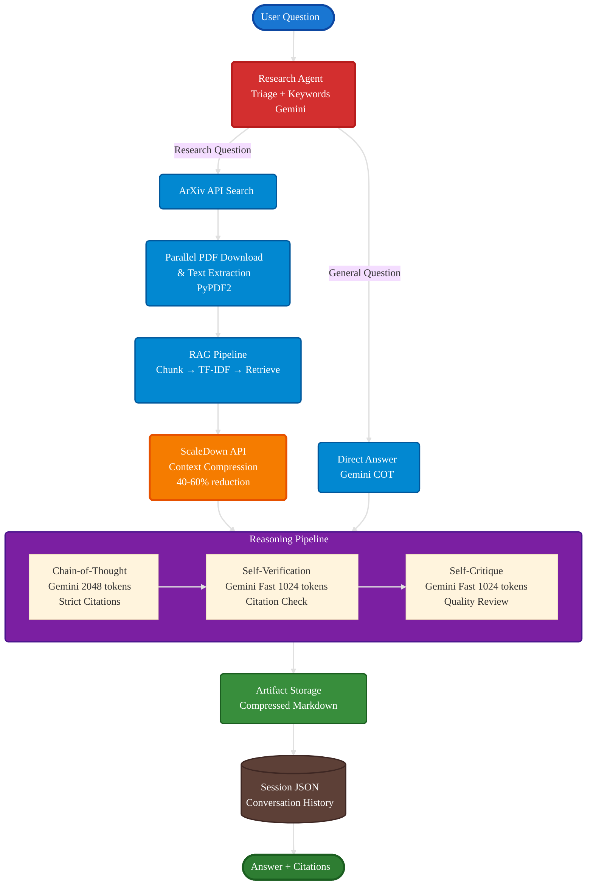

# Architecture Overview

The Scientific Literature Explorer uses a modular pipeline architecture that combines retrieval-augmented generation, context compression, and multi-stage verification to produce accurate, well-cited answers from scientific literature.

---

## System Architecture

---

## Core Components

### 1. Research Agent (Triage + Discovery)
**Purpose:** Intelligently routes questions and discovers relevant papers

- **Question Classification:** Uses Gemini to classify as `general`, `conceptual`, or `research`
- **Keyword Extraction:** Extracts search terms and ArXiv query in the same API call
- **Paper Discovery:** Searches ArXiv Atom API with parallel PDF downloads
- **Fallback Handling:** Uses heuristic keyword extraction if Gemini is rate-limited

### 2. RAG Pipeline
**Purpose:** Retrieves and prepares relevant paper content

- **Chunking:** Splits papers into overlapping segments (1000 chars, 200 overlap)
- **TF-IDF Indexing:** scikit-learn vectorization with stop-word removal
- **Retrieval:** Cosine similarity matching, returns top-k chunks (default: 5)
- **Source Tracking:** Every chunk labeled with `arxiv:XXXX.XXXXX` for citations

### 3. ScaleDown Compression
**Purpose:** Reduces token count while preserving semantic meaning

- **Context Compression:** 40-60% token reduction before sending to LLM
- **Query-Aware:** Uses the user's question to guide what information to preserve
- **Tokenizer Optimization:** Optimized for `gemini-2.5-flash` tokenizer
- **Artifact Compression:** Also compresses COT traces before storage

### 4. Anti-Hallucination Workflow
**Purpose:** Multi-stage verification ensures factual accuracy

- **Chain-of-Thought (COT):** Requires inline citations for every claim
- **Self-Verification:** Separate Gemini call checks each citation
- **Self-Critique:** Optional quality evaluation
- **Configurable:** Stages can be toggled or reordered via CLI

### 5. Artifact Storage
**Purpose:** Persistent storage of reasoning traces

- **Markdown Format:** Each stage output saved as `.md` file
- **Compression:** Artifacts compressed via ScaleDown before storage
- **Metadata:** Timestamps, token counts, compression stats tracked
- **Organization:** Separate folders for `cot/`, `self_verify/`, `self_critique/`

### 6. Session Management
**Purpose:** Maintains conversation history across interactions

- **JSON Persistence:** Each session stored as `{session_id}.json`
- **Multi-Turn Support:** Previous Q&A included in context
- **Paper Tracking:** Tracks which papers were ingested per session
- **Automatic Loading:** Latest session auto-loaded if applicable

---

## Data Flow

### Question Processing Flow

1. **User submits question** → Research Agent
2. **Triage classification** → Routes to appropriate handler
3. **Paper discovery** (if needed) → ArXiv API + parallel PDF downloads
4. **Text extraction** → PyPDF2 processes PDFs
5. **Chunking + Indexing** → TF-IDF vectorization
6. **Retrieval** → Top-k chunks by cosine similarity
7. **Compression** → ScaleDown reduces token count
8. **Reasoning** → Multi-stage workflow generates answer
9. **Storage** → Artifacts saved, session updated
10. **Response** → Final answer with citations returned

---

## Technology Stack

| Layer | Technology | Purpose |
|-------|------------|---------|
| **Intelligence** | Google Gemini 2.5 Flash | Answer generation, classification, verification |
| **Compression** | ScaleDown API | Context compression, fallback generation |
| **Paper Source** | ArXiv Atom API | Scientific paper search and metadata |
| **PDF Processing** | PyPDF2 | Text extraction from PDFs |
| **Retrieval** | scikit-learn TF-IDF | Vectorization and similarity search |
| **Storage** | JSON (sessions), Markdown (artifacts) | Persistence |
| **CLI** | Rich (terminal UI) | Interactive tables, panels, markdown rendering |

---

## Next: How It Works

See **[How It Works](how-it-works.md)** for the detailed end-to-end flow and step-by-step breakdown.
