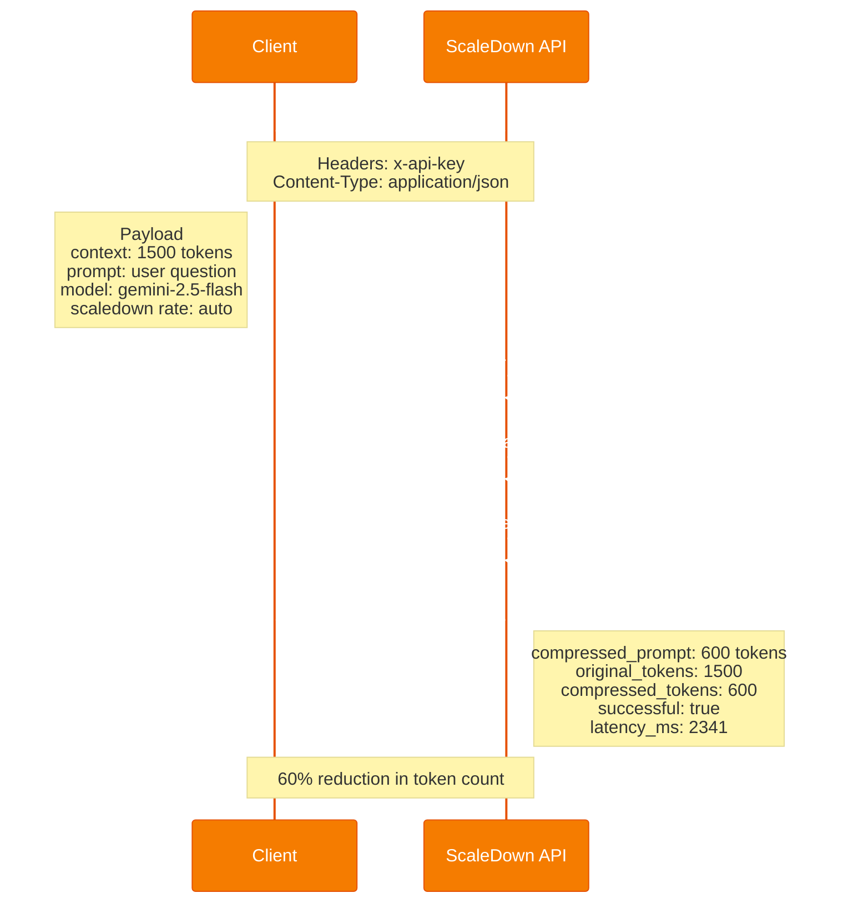

# How It Works

This page explains the end-to-end flow of the Scientific Literature Explorer from user question to final answer.

---

## End-to-End Flow

The system follows a 9-step pipeline that intelligently routes questions, discovers papers, retrieves relevant content, compresses context, and runs multi-stage verification.

### Step-by-Step Breakdown

1. **Question Triage** — The Research Agent classifies the question as `general`, `conceptual`, or `research` using Gemini. General questions (e.g., "What is CNN?") are answered directly without paper retrieval, saving significant latency.

2. **Keyword Extraction** — In the same Gemini call as triage, search keywords and an ArXiv query are extracted. This merged call halves the initial latency.

3. **Paper Discovery** — The system searches ArXiv's Atom API for relevant papers. PDFs are downloaded in parallel using `ThreadPoolExecutor` and text is extracted via PyPDF2.

4. **Chunking & Indexing** — Paper text is split into overlapping chunks (default: 1000 chars, 200 overlap) and indexed using TF-IDF vectorization (scikit-learn).

5. **Retrieval** — The top-k most relevant chunks are retrieved using cosine similarity against the TF-IDF matrix.

6. **Context Compression** — Retrieved chunks are compressed through the ScaleDown API, reducing token count while preserving semantic meaning. This is critical for fitting more information into the LLM's context window at lower cost.

7. **Reasoning Workflow** — The compressed context passes through a configurable multi-stage pipeline:
   - **Chain-of-Thought (COT)**: Gemini generates a detailed, step-by-step analysis with mandatory inline citations
   - **Self-Verification**: A faster Gemini call checks every citation against the source documents
   - **Self-Critique** (optional): Evaluates completeness, accuracy, and clarity

8. **Artifact Storage** — Each stage's output is saved as compressed markdown with metadata (timestamps, token counts, compression stats).

9. **Session Persistence** — Conversations are saved as JSON, enabling multi-turn interactions with history context.

---

## Role of ScaleDown API

**ScaleDown** is the context compression backbone of this system. It is NOT an LLM — it's a specialized service that intelligently compresses text while preserving semantic meaning.

### What ScaleDown Does

| Function | How It's Used |
|----------|---------------|
| **Context Compression** | Retrieved RAG chunks are compressed before being sent to Gemini, reducing token usage by 40-60% |
| **Query-Aware Compression** | The user's question is passed as the `prompt` parameter, so ScaleDown preserves information most relevant to the query |
| **Artifact Compression** | COT traces, verification tables, and critique outputs are compressed before storage |
| **Fallback Generation** | When Gemini is rate-limited (429), ScaleDown's compression endpoint (which internally uses GPT-4o) is used as a pseudo-generation fallback |

### ScaleDown API Endpoint



**Raw API Example:**

```bash
curl -X POST https://api.scaledown.xyz/compress/raw/ \
  -H "x-api-key: YOUR_KEY" \
  -H "Content-Type: application/json" \
  -d '{
    "context": "The text to compress...",
    "prompt": "The user question (guides compression)",
    "model": "gemini-2.5-flash",
    "scaledown": { "rate": "auto" }
  }'
```

### ScaleDown as Fallback

When Gemini hits its rate limit (429 errors), the system automatically falls back to ScaleDown:

```
Gemini (primary) → rate limited → ScaleDown compression-as-generation (fallback)
```

ScaleDown's internal model processes the system prompt + user question as "context" and produces a compressed, relevant extraction. While not a full generative response, it captures the key facts from the provided context.

---

## Role of Google Gemini

**Gemini 2.5 Flash** is the intelligence layer — it generates answers, classifies questions, extracts keywords, and powers the anti-hallucination pipeline.

### Gemini Usage in the System

| Component | Model Config | Purpose |
|-----------|-------------|---------|
| **Question Triage + Keywords** | `temperature=0.0` | Classifies question complexity and extracts search keywords in one call |
| **COT Reasoning** | `max_tokens=8192`, `thinking_budget=2048` | Full chain-of-thought analysis with citations |
| **Self-Verification** | `max_tokens=4096`, `thinking_budget=1024` | Faster/cheaper — checks citations against source text |
| **Self-Critique** | `max_tokens=4096`, `thinking_budget=1024` | Faster/cheaper — evaluates answer quality |
| **Direct Answers** | `max_tokens=8192`, `thinking_budget=2048` | For general questions that don't need papers |

### Thinking Budget

Gemini 2.5 Flash supports a `thinkingConfig` parameter that caps internal reasoning tokens. We use:
- **2048 tokens** for primary reasoning (COT, direct answers)
- **1024 tokens** for lighter tasks (verify, critique)

This prevents the model from spending excessive time on internal reasoning, reducing latency by ~40%.

### Rate Limit Handling

```python
# Exponential backoff: 5s, 10s, 20s, 40s, 60s
# After 5 retries → raises GeminiRateLimitError
# Caller catches it → falls back to ScaleDown
```

---

## Next: Setup Instructions

See **[Getting Started](setup.md)** for installation and configuration.
