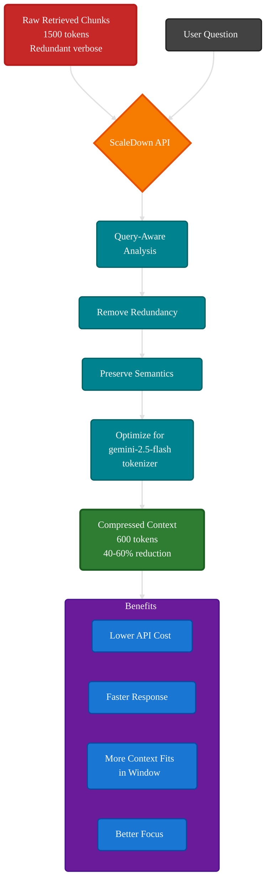
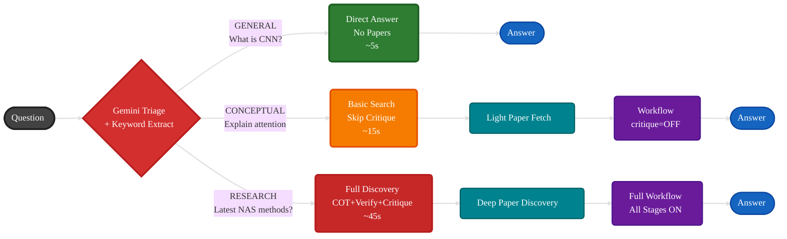
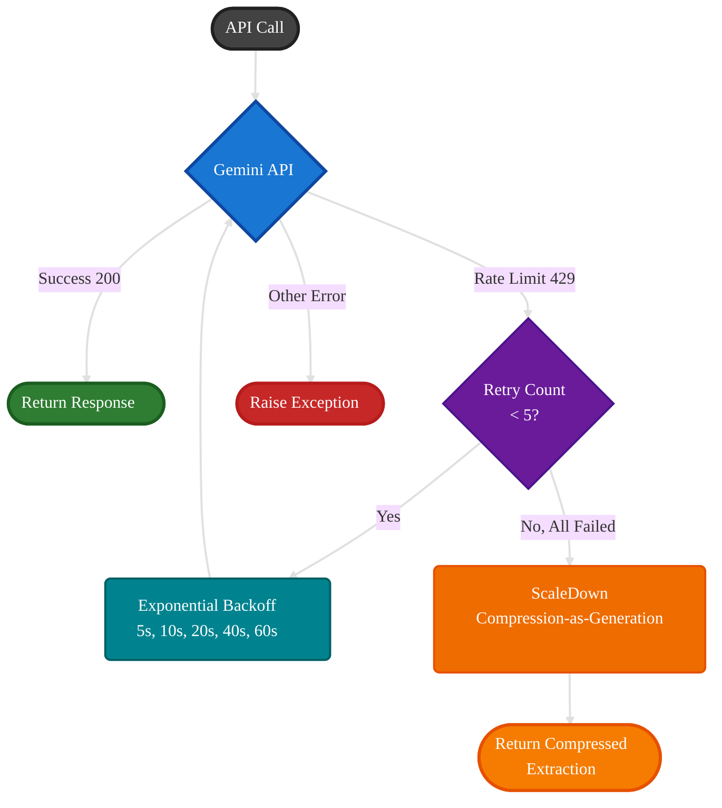

# Methodology

This page explains the technical approaches and design patterns used in the Scientific Literature Explorer.

---

## 1. Retrieval-Augmented Generation (RAG)

```mermaid
%%{init: {'theme':'base','themeVariables':{'fontFamily':'sans-serif'}}}%%
flowchart LR
    Paper([Paper Text]) --> Chunk[Chunking<br/>1000 chars<br/>200 overlap]
    
    Chunk --> Vec[TF-IDF<br/>Vectorization<br/>sklearn]
    Vec --> Index[(Chunk Index<br/>Sparse Matrix)]
    
    Query([User Query]) --> QVec[Vectorize Query<br/>Same TF-IDF]
    QVec --> Sim[Cosine<br/>Similarity]
    Index --> Sim
    
    Sim --> TopK[Top-K Chunks<br/>default: 5]
    TopK --> Compress[ScaleDown<br/>Compression<br/>40-60% reduction]
    
    Compress --> LLM[Gemini<br/>Generation]
    LLM --> Answer([Answer with<br/>Citations])
    
    style Paper fill:#424242,stroke:#212121,stroke-width:3px,color:#fff,rx:10,ry:10
    style Query fill:#424242,stroke:#212121,stroke-width:3px,color:#fff,rx:10,ry:10
    style Index fill:#1565c0,stroke:#0d47a1,stroke-width:3px,color:#fff,rx:5,ry:5
    style Compress fill:#f57c00,stroke:#e65100,stroke-width:3px,color:#fff,rx:5,ry:5
    style Answer fill:#2e7d32,stroke:#1b5e20,stroke-width:3px,color:#fff,rx:10,ry:10
    style Chunk fill:#00838f,stroke:#006064,stroke-width:2px,color:#fff,rx:5,ry:5
    style Vec fill:#00838f,stroke:#006064,stroke-width:2px,color:#fff,rx:5,ry:5
    style QVec fill:#00838f,stroke:#006064,stroke-width:2px,color:#fff,rx:5,ry:5
    style Sim fill:#6a1b9a,stroke:#4a148c,stroke-width:2px,color:#fff,rx:5,ry:5
    style TopK fill:#6a1b9a,stroke:#4a148c,stroke-width:2px,color:#fff,rx:5,ry:5
    style LLM fill:#1976d2,stroke:#0d47a1,stroke-width:2px,color:#fff,rx:5,ry:5
    
    linkStyle default stroke:#e0e0e0,stroke-width:2px
```



The RAG pattern ensures answers are grounded in actual paper content rather than relying solely on the LLM's training data:

- **Chunking**: Papers are split into overlapping segments (1000 chars, 200 overlap) to ensure no information is lost at boundaries
- **TF-IDF Vectorization**: scikit-learn's `TfidfVectorizer` creates sparse vector representations with English stop-word removal
- **Cosine Similarity**: Queries are matched against the chunk index; top-k (default 5) most similar chunks are retrieved
- **Source Tracking**: Every chunk retains its source label (e.g., `arxiv:2511.14362`) for citation tracing

---

## 2. Context Compression (ScaleDown)



Raw retrieved chunks are often redundant. ScaleDown's compression:
- Reduces token count by 40-60% while preserving semantics
- Uses the user's question as a guide (`prompt` parameter) to prioritize relevant information
- Optimizes for the target model's tokenizer (`gemini-2.5-flash`)
- The `"rate": "auto"` setting lets ScaleDown determine optimal compression

---

## 3. Multi-Stage Reasoning Workflow

Inspired by research on self-verification and chain-of-verification (CoVe):

- **Chain-of-Thought**: Forces step-by-step reasoning, reducing reasoning errors
- **Self-Verification**: A separate LLM call cross-references every claim against source documents
- **Self-Critique**: An independent evaluator checks for completeness and accuracy
- Stages are **configurable** — enable, disable, or reorder via CLI

---

## 4. Question Triage



A single Gemini call classifies questions into three tiers:
- **General**: Simple factual questions → answered directly (no paper fetch, ~5s)
- **Conceptual**: Needs depth but not specific papers → uses workflow but may skip critique
- **Research**: Needs actual papers → full discovery + workflow pipeline

This saves 60-90 seconds for simple questions by skipping paper discovery entirely.

---

## 5. Resilient LLM Strategy



**Implementation:**
```python
Primary: Gemini 2.5 Flash (full generation)
    │
    ├── Rate limited (429)?
    │   └── Retry with exponential backoff (5× up to 60s)
    │       └── Still limited?
    │           └── Fallback: ScaleDown compression-as-generation
    │
    └── Research Agent rate-limited?
        └── Heuristic keyword extraction (regex-based, no API call)
```

---

## Next: Anti-Hallucination Details

See **[Anti-Hallucination Pipeline](anti-hallucination.md)** for the full verification workflow.
